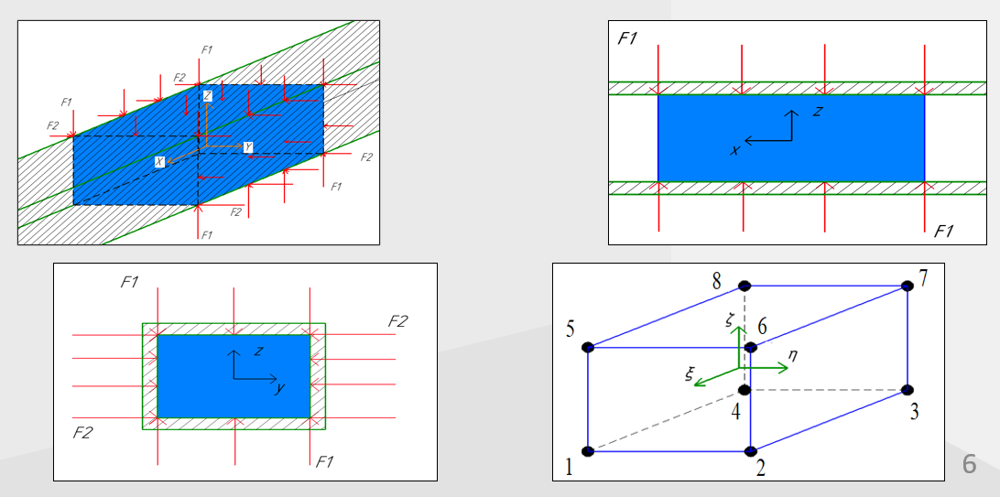
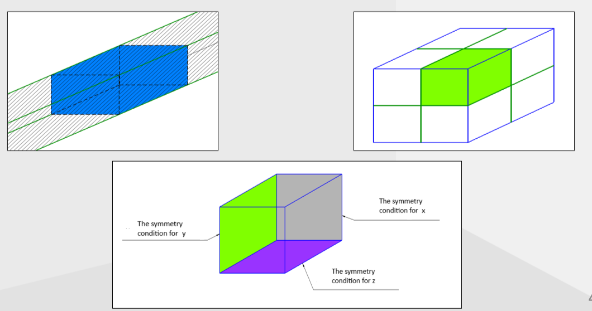

friction_problem
================

 A project for calculating the effect of all-round friction forces of various
kinds on a body.
	
Setting the task. 
-----------------

 The body is a parallelepiped that is located in a rectangular cross-sectional
tube (a simplified version of a piston in a cylinder).  To set the all-round dry
friction, a condition is set for constant compression of the walls with the same
force on the "cylinder". In the case of viscous friction, this condition does not
apply. Next, the body is divided into 8 finite elements in the form of 8-node 
parallelepipeds. After that, one of them is considered with the conditions of 
symmetry imposed on it.

All data is presented in SI without the prefixes "kilo- (K)", "mega- (M)", etc.

**Setting the task:**



**Symmetry conditions:**



How to use the app?
-------------------

The main file code is stored in the apps folder under the name friction_main.cpp

1. You can change the parameters manually (y) or select the default values (n).
By default, the modulus of elasticity, Poisson's ratio, and density are selected
for aluminum, and the dimensions of the final element: length, width, and height
are 10 centimeters, 6 centimeters, and 5 centimeters, respectively.

	**Example of selection:**

	```cpp
	Do you want to enter the parameters manually? (y/n)
	n
	The parameters are selected by default:
	modulus elastic = 7e+10;
	poisson's ratio = 0.33;
	dencity = 2700;
	length = 0.1;
	width = 0.06;
	heigth = 0.05;
	```

2. After that, you need to enter the oscillation time and the time step.

	**Example of selection:**

	```
	Enter the oscillation time:
	0.1
	The value is set: 0.1

	Enter the time step:
	0.0000001
	The value is set: 1e-07
	```

3. Next, you can set the initial displacements (y), or leave them zero (n).
If you decide to set the initial movements, then you need to introduce an
instant static load, which is distributed over the active degrees of freedom
of the nodes of the front face of the final element (1, 2, 5 and 6).
The load setting is necessary because the initial movements in the program
are from a static problem for convenience.  
(Active degrees of freedom are degrees of freedom that coincide with
the direction of movement of the body and are not fixed by symmetry conditions).

	**Example of selection:**

	```
	Do you want to set an initial displacements from a static task (y / n)?
	y
	Input the initial static load acting on the edge:
	10000
	The value is set: 10000
	```

4. Then you can select the type of problem you need:

	**Example of selection:**

	```
	Input 1 or 2, or 3, where 1 is a problem with dry friction
	without a driving force, 2 is a problem with dry friction with a
	driving force, and 3 is a problem with viscous friction and
	a driving force.
	1
	The value is set: 1
	```
	
	4.1 **If problems 1 and 2 are selected:**
	
	You will need to enter the coefficients of dry friction of
	rest and dry friction of sliding.
	
	**Input example:**

	```
	Input coefficient of dry friction at rest
	0.5
	The value is set: 0.5

	Input coefficient of dry friction at sliding
	0.3
	The value is set: 0.3
	```

	4.2 **If problem 3 are selected:**
	
	You need to enter the coefficient of viscous friction.

	**Input example:**

	```
	Input coefficient viscous friction:
	0.8
	The value is set: 0.8
	```

5. Next, you can choose the initial velocity and initial acceleration,
which are set for each active degree of freedom, rather than distributed
over them.

	**Input example:**

	```
	Input the initial acceleration:
	0.5
	The value is set: 0.5

	Input the initial speed:
	1.5
	The value is set: 0.7
	```
	
6. If you have selected problem type 2 or 3, then you can select the values
of the amplitude and frequency of the driving force by default, or enter
them yourself. Moreover, for the frequency of the driving force, you must
enter the coefficient before PI, and not the frequency value itself. 
(If you have selected problem type 1, then you will not have these choices)
	
	**Input example:**

	```
	The default value of a driving force frequency is 40 * PI,
	do you want to change it (y/n)?
	y
	Input the coefficient before the frequency of the driving force:
	30
	The value is set: 30

	The default value of the amplitude of the
	driving force acting on the final element is 300,
	do you want to change it(y / n) ?
	y
	Input the amplitude value:
	100
	The value is set: 100
	```
	
7. If you have selected task type 1 or 2, then you can choose the strength
of the normal reaction to the nodes (by degrees of freedom directed to the
walls of the pipe) by default, or set it yourself. This force simulates the
counteraction of an all-round compressive force with the same value. It is 
set with the same value for each node. 
(If you have selected task type 3, then you do not have this choice)
	
	**Input example:**
	
	If the task type is 1:
	
	```
	The default value of a normal reaction is 400,
	do you want to change it (y/n)?
	n
	The default value is : 400
	```
	
	If the task type is 2:
	
	```
	The default value of a normal reaction is 100,
	do you want to change it (y/n)?
	y
	Input the value of the normal reaction:
	150
	The value is set: 150
	```

**Data output**

If everything is successful, the movements are output to a file
displacements.txt , which will be in your build directory,
and the terminal will output:

```
File is open
```
	
(If you don't need to output the movements to a file, just comment in                      
friction_main.cpp in apps, "writeDispSecondNode(displacements)")

A displacement graph will also be displayed, which will be in your build
directory named graph.png.

Libraries used
--------------

The program uses its own library ***MFE_lib(The method finite element)*** and
***matplotlib-cpp***. The matplotlib-cpp library is used to output graphs. 
My MFE_lib library describes the basic algorithms for solving.

**The main functions, structures, and classes that MFE_lib provides:**

***class_matrix.h:***

You can create matrices and interact with them:

	```cpp
	// Create a matrix without specifying the number of rows and columns
	Matrix();

	// Creating a matrix by specifying rows and columns, while the matrix
	is immediately filled with zero elements
	Matrix(const UnsignedType& rows, const UnsignedType& columns);

	// Creating a matrix using a list {{}, {}, {}, ...}
	Matrix(std::initializer_list<std::vector<T>> values);

	// The [] operator for reading
	const std::vector<T>& operator[] (const UnsignedType& index) const;

	// The [] operator for modification
	std::vector<T>& operator[] (const UnsignedType& index);

	// Getting the number of rows of a matrix
	UnsignedType sizeRows() const;

	// Getting the number of columns of a matrix
	UnsignedType sizeColumns() const;

	// Deleting a row of the matrix
	void eraseRow(const UnsignedType& index);

	// Deleting a column of the matrix
	void eraseColumn(const UnsignedType& index);

	// Checking for the emptiness of the matrix
	bool empty() const;
	```

***initial_conditions.h:***

Here are the functions for setting the initial kinematic boundary conditions:

	```cpp
	// Oscillation time setting function
	MFE_LIB_EXPORT Real inputTime();

	// Time step setting function
	MFE_LIB_EXPORT Real inputDeltaT();

	// Everywhere "size" is the row size of the stiffness matrix.

	// The function of setting a static load to solve a static problem.
	// initialForce - the force that you set to the edge
	RealVector makeInitialStaticForce
	(const Real& initialForce, const UnsignedType& size);

	// The function of setting initial displacements by finding
	// displacements from a static problem or manually setting displacements
	RealVector makeInitialDisps(RealMatrix matrixStiffness);

	// The function of setting the initial speeds manually.
	RealVector makeInitialSpeed(const UnsignedType& size);

	// The function of setting the initial acceleration manually.
	RealVector makeInitialAccel(const UnsignedType& size);

	// Applying symmetry conditions for a static problem on matrix stiffness.
	void boundConditionStatic(RealMatrix& matrixStiffness);

	// The function of calculating the movements of a static problem
	// force - the static force
	RealVector calculateDispStatic
	(const RealMatrix& matrixStiffness, const RealVector& force);
	```

***math_functions.h:***

Mathematical functions and matrices that are used in the program:

	```cpp
	// Matrix Cholesky
	// The Cholesky matrix is obtained by decomposing a matrix of coefficients;
	// in the case of the finite element method, it is a stiffness matrix.
	// matrix - the matrix you need.
	RealMatrix createMatrixCholesky(const RealMatrix& matrix);

	// Transpose matrix
	// noTranspose - the untransposed matrix
	RealMatrix transpose(const RealMatrix& noTranspose);

	// The identity matrix
	RealMatrix identityMatrix(const UnsignedType& rows);

	// Solving a system of linear equations by reflection method
	RealVector solveReflectionMethod(const RealMatrix matrixCoefficients,
		const RealVector freeTerms);
	```

***matrix_MFE.h:***

Object creation functions for the finite element method.

	```cpp
	// Finite element structure, default structure fields:
	struct FiniteElement
	{
		// Material properties: modulus Elastic, Poisson's ratio, dencity
		Real modulusElastic = 7e10;
		Real poissonRatio = 0.33;
		Real dencity = 2700.0;

		// Dimensions of the final element
		Real length = 0.10;
		Real width = 0.06;
		Real heigth = 0.05;
	};

	// Entering material properties manually
	void setMaterialProperties(FiniteElement& finiteElement);

	// The choice of setting material properties: by default or manually
	void chooseMaterialProperties(FiniteElement& finiteElement);

	// This function gives a matrix of local coordinates for an 8 - 
	// node parallelepiped, where 1 row is the ksi coordinates,
	// 2 row is the etta coordinates, and 3 row is the psi coordinates.
	RealMatrix getLocalCoordinate();

	// locCoord - these are the local coordinates of the point (ksi, etta, psi)

	// The shape function
	// quadPoint - these are the quadratic coordinates of a point, which are 
	// expressed in terms of local coordinates. 
	// example : quadratic coordinate first = sqrt(3.0) / 3.0 * ksi. 
	Real shapeFunction(const Array3D& locCoord, const Array3D& quadPoint);

	// The derivative of the shape function by ksi
	Real dShapeFuncKsi(const Array3D& locCoord,
		const Real& quadraticPointEtta, const Real& quadraticPointPsi,
		const Real& length);

	// The derivative of the shape function by etta
	Real dShapeFuncEtta(const Array3D& locCoord,
		const Real& quadraticPointKsi, const Real& quadraticPointPsi,
		const Real& width);

	// The derivative of the shape function by psi
	Real dShapeFuncPsi(const Array3D& locCoord,
		const Real& quadraticPointKsi, const Real& quadraticPointEtta,
		const Real& higth);

	// Its function creates a elastic constants matrix
	RealMatrix makeMatrixElConst(const UnsignedType& rows,
		const UnsignedType& columns, const Real& modulusElastic,
		const Real& poissonRatio);

	// Its function creates a matrix of quadratic points
	RealMatrix makeMatrixQuadPoints(const UnsignedType& rows,
		const UnsignedType& columns, const RealMatrix& localCoordinate);

	// Its function creates a matrix that is the product of the transposed
	// differentiation matrix and the matrix of elastic constants
	// There "bt" - the transposed matrix b, where matrix b is the
	// matrix of differentiation from the finite element method;
	// D is the matrix of elastic constants, i.e. the matrix ElasticConst.
	// Its matrix product "bt" and "matrix of elastic constants".
	RealMatrix makeMatrixBtD(const RealMatrix& bTranspose,
		const RealMatrix& elasticConstMatrix);

	// Its function creates a diagonal mass matrix
	// size - this is the size of the stiffness matrix
	RealMatrix makeMatrixMassDiag(const UnsignedType& size,
		const FiniteElement& finiteElement);

	// Its function creates a stiffness matrix
	RealMatrix makeMatrixStiffness(const FiniteElement& finiteElement);
	```

***dinamic_solver_MFE.h:***

Functions for solving dynamic friction problems:

	```cpp
	// Coefficients that are present in the displacement equations.
	// These values ensure high accuracy and stability of the solution when
	// using the Nmork method.
	constexpr Real ALPHA = 0.25;
	constexpr Real DELTA = 0.5;

	// Applying symmetry conditions for a dinamic problem to a stiffness matrix,
	// a mass matrix, a velocity vector, a displacement vector
	// (meaning a row of the displacement matrix, since the matrix is constructed
	// from displacement vectors for each time step), an acceleration vector,
	// and a force vector.
	void boundConditionsDinamic(RealMatrix& matrixStiffness,
		RealMatrix& matrixMass, RealMatrix& displacement,
		RealVector& speed, RealVector& acceleration,
		RealVector& force);

	// The decision functions take as input the number of time steps, the time step,
	// the stiffness matrix, the mass matrix, and the displacement matrix, in which
	// the initial displacements are recorded and in which the displacements will
	// be recorded.

	// stepsCount = time / deltaT

	// A function that solves the problem of dry friction without forcing force.
	// The function asks you to enter the coefficients of dry friction of rest
	// and dry friction of sliding.
	void dryFrictionFree(const UnsignedType& stepsCount,
		const Real& deltaT, RealMatrix matrixStiffness,
		RealMatrix matrixMass, RealMatrix& displacements);

	// A function that solves the problem of dry friction with a driving force.
	// The function asks you to enter the coefficients of dry friction of rest
	// and dry friction of sliding.
	void forcedDryFriction(const UnsignedType& stepsCount,
		const Real& deltaT, RealMatrix matrixStiffness,
		RealMatrix matrixMass, RealMatrix& displacements);

	// A function that solves the problem of viscous friction with 
	// a driving force.
	// The function asks you to enter the coefficient of viscous friction
	void viscousFrictionForce(const UnsignedType& stepsCount,
		const Real& deltaT, RealMatrix matrixStiffness,
		RealMatrix matrixMass, RealMatrix& displacements);


	// Solver for dinamic problem.
	// It consists of a solver for the problem of dry friction without
	// a driving force, dry friction with a driving force and viscous
	// friction with a driving force.
	// The solver takes the oscillation time, time step, stiffness matrix
	// and mass matrix as input
	RealMatrix calculateDisplacementsDinamic
	(const Real& time, const Real& deltaT,
		RealMatrix matrixStiffness, RealMatrix matrixMass);
	```

***write_functions.h:***

Functions for recording displacements and time in files displacements.txt
and time.txt:
	
	```cpp
	//If it is not written to the file, the functions return false, otherwise true.
	
	// Writing to the file the displacements of nodes 1, 2, 5, 6 in the direction of 
	// movement in a time step deltaT during time "time".
	// rows is the number of rows of the displacement matrix, and displacements is
	// the displacement matrix.
	bool writeDispAllNodes(const RealMatrix& displacements);
	
	// Writing to the file the displacements of node 1 in the direction of 
	// movement in a time step deltaT during time "time".
	bool writeDispFirstNode(const RealMatrix& displacements);
	
	// Writing to the file the displacements of node 2 in the direction of 
	// movement in a time step deltaT during time "time".
	bool writeDispSecondNode(const RealMatrix& displacements);
	
	// Writing to the file the displacements of node 5 in the direction of 
	// movement in a time step deltaT during time "time".
	bool writeDispFifthNode(const RealMatrix& displacements);
	
	// Writing to the file the displacements of node 6 in the direction of 
	// movement in a time step deltaT during time "time".
	bool writeDispSixthNode(const RealMatrix& displacements);
	
	// Writing deltaT time intervals to a file during the "time" time.
	// steps = time / deltaT
	bool writeStepsTime(const UnsignedType& steps, const Real& deltaT);
	```

***gets_disps_func.h:***

Functions for obtaining displacements after solving from the
displacement matrix:

	```cpp
	// Getting the displacements of nodes 1, 2, 5, 6 in the direction of 
	// movement in a time step deltaT during time "time".
	// rows is the number of rows of the displacement matrix, and displacements is
	// the displacement matrix.
	RealMatrix getDispAllNodes(const RealMatrix& displacements);

	// Getting the displacements of node 1 in the direction of movement 
	// in a time step deltaT during time "time".
	RealVector getDispFirstNode(const RealMatrix& displacements);

	// Getting the displacements of node 2 in the direction of movement 
	// in a time step deltaT during time "time".
	RealVector getDispSecondNode(const RealMatrix& displacements);

	// Getting the displacements of node 5 in the direction of movement 
	// in a time step deltaT during time "time".
	RealVector getDispFifthNode(const RealMatrix& displacements);

	// Getting the displacements of node 6 in the direction of movement 
	// in a time step deltaT during time "time".
	RealVector getDispSixthNode(const RealMatrix& displacements);

	// Getting a vector of time steps.
	// steps = time / deltaT
	RealVector getStepsTime(const UnsignedType& steps, const Real& deltaT);
	```

How to install
--------------

To install the app, you need to:

```cpp
# Clone my repository
git clone https://github.com/RomanSalimgareev/friction_problem

#	Next, you need to clone the matplotlib-cpp library.
# I found this method easier than messing with vcpkg.
git clone https://github.com/lava/matplotlib-cpp/tree/master libs/matplotlib-cpp

# Build the library using cmake matplotlibcpp in its build folder and install it,
# say, in the install folder in the root directory of my cloned repository.
cd libs/matplotlib-cpp

# You can specify the install prefix for cmake either during configuration
cmake -S . -B build -DCMAKE_INSTALL_PREFIX="<your_path/friction_problem/install>"
cmake --build build --config Release
# Alternatively, you can specify the install prefix for cmake during installation.
cmake --install build --prefix <your_path/friction_problem/install>"

# Next, it remains to build the application itself, indicating where to look for
# the matplotlib-cpp config files..
cd ../../
cmake -S . -B build -DCMAKE_PREFIX_PATH="<your_path>friction_problem/install"
cmake --build build --config Release
```

The file friction_problem.exe It will be located in the
	
```<your_path>friction_problem/apps/bin/Release folder./```
	
If you don't need to build an application, but only the MFE_lib library,
you can build it in the same way as matplotlib-cpp, because it can also
be connected via find_package() in cmake.  In this case, the MFE_lib 
alias will be used for the target_link_libraries() command.::MFE_lib.
(In my project, it is connected via add_subdirectory())
